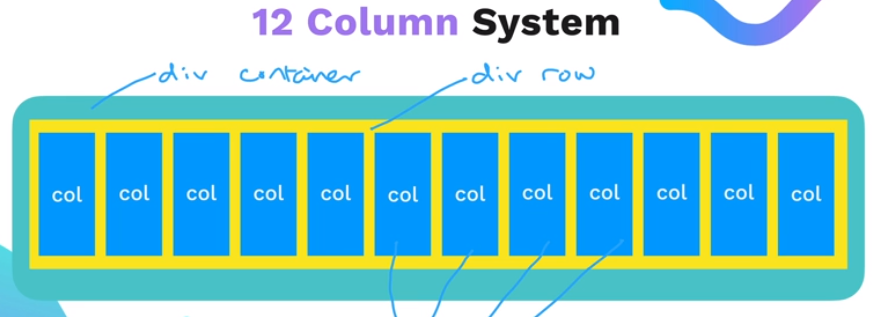
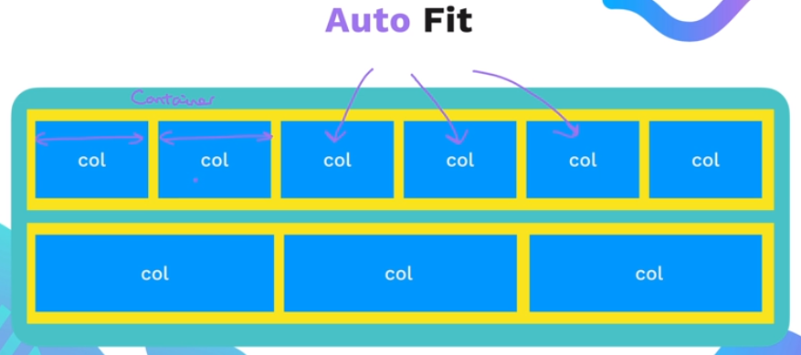
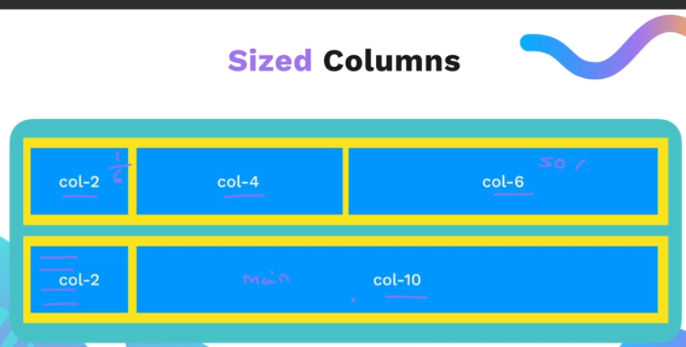
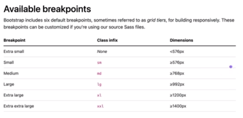
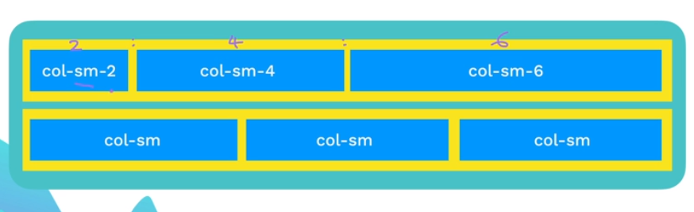
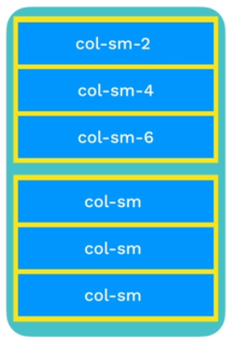
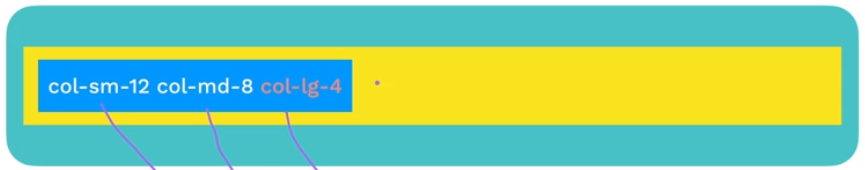

# 64. What is Bootstrap ?
## It is an amazing CSS frameworks that helps build mobile first, responsive websites quickly.
## good for uniformity and all device compatibility

## Frameworks: 
- Pre made code components that can help developers do their job faster and better
- Boostrap is a CSS framework.. it has prewritten CSS elements
- Popular CSS frameworks: Boostrap,Foundation, Animate, tailwind css, etc

## Downsides of CSS frameworks:
1. Class Bloat: too much styling, doesnt look clean, too many classes
2. Not very customizable

# 65. Bootstrap Layout
## - Has 12 coloumn system:

## Gives equal spacing to all elements in a row:(autofit)

### Small is for mobile  ----sm 
### Medium is for tablets---md
### LArge is for laptops----lg
### XL is for Desktops ----xl

### Exaple:

## Multiple Breakpoints: 
- Different screens will jhave different layout of the class

## [This](https://appbrewery.github.io/bootstrap-layout/) is to practice coloumn layout

