# Section 16: DOM model
## [115. Adding JS to websites]()
## [116. Intro to DOM ]()
## [117. Soln to DOM cahallege](https://github.com/vinitkesh/webdev.notes/blob/main/Udemy%20%3A%20The%20complete%202023%20Web%20dev%20Bootcamp/S16_DOM.md#117-soln-to-dom-cahallege-1)
## [118. Selecting html elements in js](https://github.com/vinitkesh/webdev.notes/blob/main/Udemy%20%3A%20The%20complete%202023%20Web%20dev%20Bootcamp/S16_DOM.md#118-selecting-html-elements-in-js-1)
## [119. Manipulating styles](https://github.com/vinitkesh/webdev.notes/blob/main/Udemy%20%3A%20The%20complete%202023%20Web%20dev%20Bootcamp/S16_DOM.md#119-manipulating-styles-1)
## [120. Structure vs style vs behaviour](https://github.com/vinitkesh/webdev.notes/blob/main/Udemy%20%3A%20The%20complete%202023%20Web%20dev%20Bootcamp/S16_DOM.md#120-structure-vs-style-vs-behaviour-1)
## [121. Text manipulation, Text content ](https://github.com/vinitkesh/webdev.notes/blob/main/Udemy%20%3A%20The%20complete%202023%20Web%20dev%20Bootcamp/S16_DOM.md#121-text-manipulation-text-content)
## [122. Manipulating attributes](https://github.com/vinitkesh/webdev.notes/blob/main/Udemy%20%3A%20The%20complete%202023%20Web%20dev%20Bootcamp/S16_DOM.md#122-manipulating-attributes-1)
## [123. tips](https://github.com/vinitkesh/webdev.notes/blob/main/Udemy%20%3A%20The%20complete%202023%20Web%20dev%20Bootcamp/S16_DOM.md#123-tips-1)

# 115. Adding JS to websites

## Type 1 : Inline JS
- Try to avoid

    
## Type 2 : Internal JS
- Try to put script element after initial html structure of the site, in the body

  
    


---
# 116. Intro to DOM 

- Browser converts html into a structure to access and manipuate an internal copy


- Example :


has dom representation of :


- Accessing elements using document

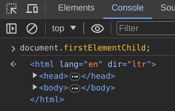

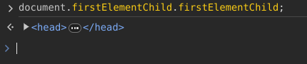

### An object inside dom has 2 properties:

1. Properties: Describes smotheing about the object
2. Methods:  Describes what it can do

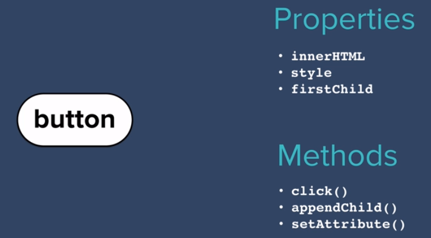

### 2 actions on properties: 
- Get property eg. firstElementChild, .innerHTML , etc
- Set property :
    get property with '=' and a new value;


---
# 117. Soln to DOM cahallege

---
# 118. Selecting html elements in js
### Changing the inner HTML part of h1 in console using the document to a differernt value :
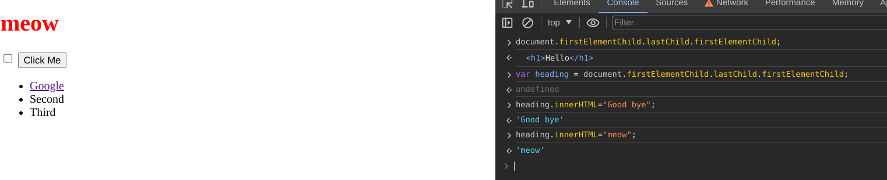

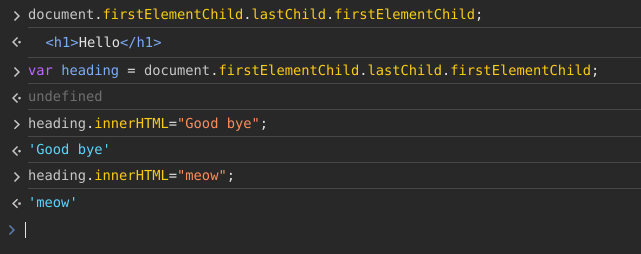

### 1. Tag selector
## eg:  
```
document.getElementByTagName("li") 
```
### //gives an **array** of all list elements  


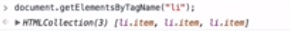  
```
document.getElementByTagName("li")[2].style.color = "purple" ; 
```
### //changes color of 3rd list item to purple
```
document.getElementByTagName("li").length;
```
### //gives how many li elements are present in thatl location
    
## 2. Query selector method :
```
document.querySelector("h1");
```
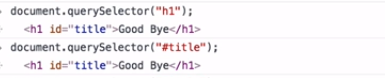  
//gives  
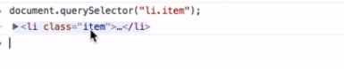  
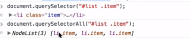  
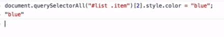


---
# 119. Manipulating styles

- Input goes as a string ie in double quotes

  
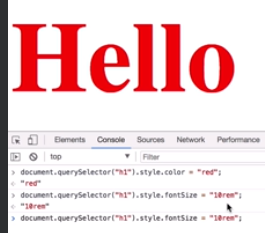  
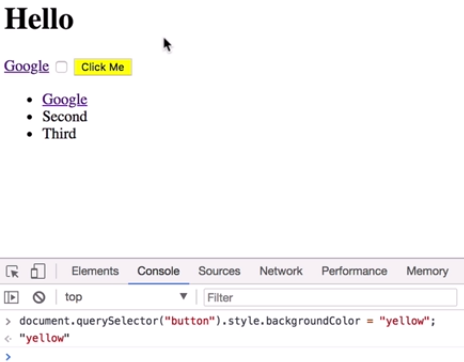

---
# 120. Structure vs style vs behaviour

---
# 121. Text manipulation, Text content 

---
# 122. Manipulating attributes
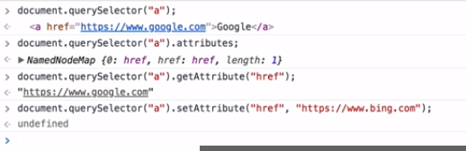

---
# 123. tips

---
