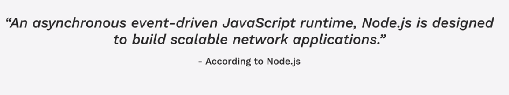
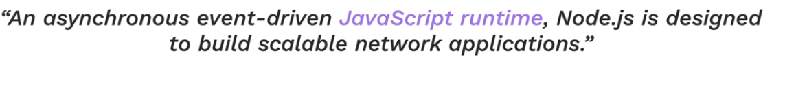
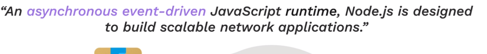
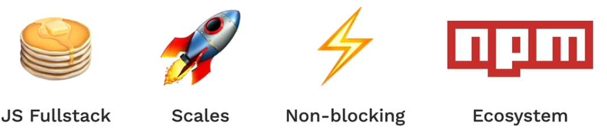

# Node.JS

- Why use frameworks anyways ?
- We can use a lot of prewritten code(framework code)

## 193. What is Node.JS
  
---

### - Provides runtime to machines

### - the code doesnt have to run everything sequentially  
---
  
 

## Node JS webapps:

  

## 194. Install Node.js on Mac
## 195. Install Node.js on Windows
## 196. Using Node.js
## 197. How to Use the Native Node Modules
## 198. The NPM Package Manager and Installing External Node Modules
## 199. [Project] QR Code Generator
## 200. Tip from Angela - Step Up to the Challenge