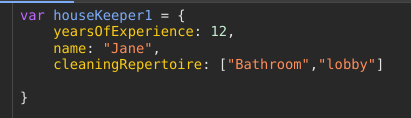
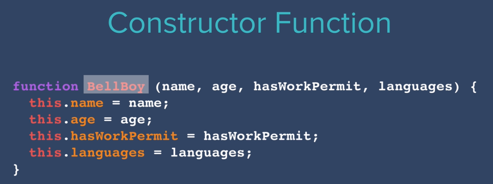
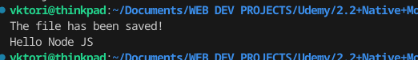
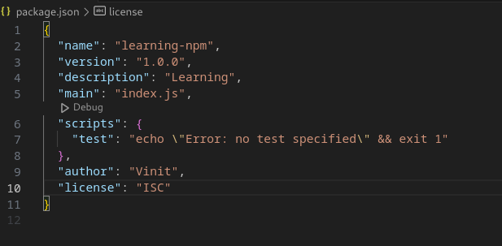
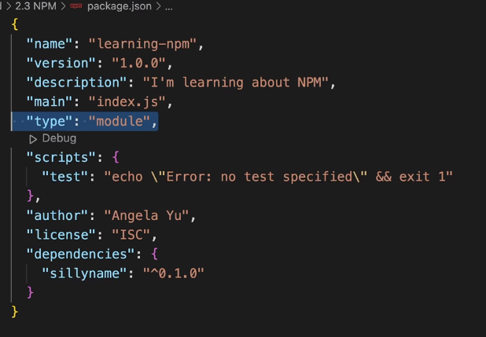
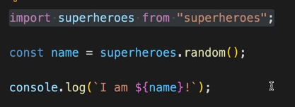

# Node.JS


- Why use frameworks anyways ?
- We can use a lot of prewritten code(framework code)


## 193. What is Node.JS
  

> Asynchronous event-driven
- JS code doesnt have to do from beginning to end
- it ties up resources
- 
- We can parcel up bits of code into events and code triggers only when the code is triggered does the event run
---

### - Provides runtime to machines

### - the code doesnt have to run everything sequentially  
---
  
 


## Node JS webapps:

  


## 196. Using Node.js

### NODE REPL : Read Eval Print Loop

type: 
```bash
node
```

# [Cheat Sheet Link](https://www.codecademy.com/learn/learn-node-js/modules/intro-to-node-js/cheatsheet)

Running a JS file out of a browser in a terminal :



## 197. How to Use the Native Node Modules
- What are **node modules** -  A starting toolset to make it easier to build webapps

### File system native module

```node:fs```

### [Documentation Of](https://nodejs.org/api/fs.html#file-system) ```$node:fs```

```js
const fs = require("fs")

fs.writeFile("message.txt", "Hello Node JS", (err) => {
  if (err) throw err;
  console.log("The file has been saved!");
});
```


<details>
  <summary >Chatgpt explaination:</summary>


Certainly! This code is a simple example of using the `fs` module in Node.js to write data to a file asynchronously. Let's break down each part of the code:

1. **Require the `fs` module:**
   ```javascript
   const fs = require("fs");
   ```
   In Node.js, the `fs` (file system) module provides functionality for interacting with the file system. Here, it is being imported using the `require` statement.

2. **Use `writeFile` method to write data to a file:**
   ```javascript
   fs.writeFile("message.txt", "Hello Node JS", (err) => {
   ```
   The `writeFile` method is used to asynchronously write data to a file. It takes three parameters:
   - `"message.txt"`: The name of the file to be written to.
   - `"Hello Node JS"`: The data to be written to the file.
   - `(err) => { /* callback function */ }`: A callback function that will be called once the writing operation is complete. If an error occurs during the write operation, it will be passed to this callback as the `err` parameter.

3. **Handle errors:**
   ```javascript
   if (err) throw err;
   ```
   This line checks if an error occurred during the file write operation. If an error is present, it is thrown, which typically terminates the program and prints an error message.

4. **Print success message:**
   ```javascript
   console.log("The file has been saved!");
   ```
   If there is no error during the write operation, this line prints a success message to the console.

In summary, this code writes the string "Hello Node JS" to a file named "message.txt" asynchronously. It checks for errors during the write operation and prints a success message if the operation is successful. Note that the use of the callback function ensures that the code is non-blocking, allowing other operations to continue while the file write is in progress.

</details>







## 198. The NPM Package Manager and Installing External Node Modules

NPM is the open source library to find tools /code.

- Nmp comes prebundled with node




How to install a package and use it ?
 ;aonf;san


### To use the the ```import xxx from "aav" ```-thingy :


### Add ```"type" = "module" ```
   

   



JSON : Javascript Object Notation
## 199. [Project] QR Code Generator
## 200. Tip from Angela - Step Up to the Challenge