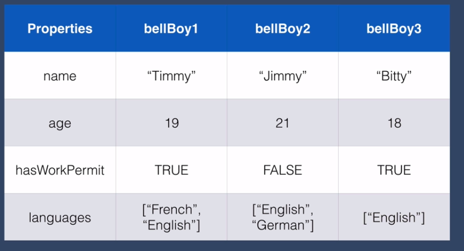

# API

## - Bridges communication different software

## What if we have to get data from a sever OpenWeather to get weather data

- And use it in our website

Different types of APIs:

- These are architectural styles for creating an API
- Do we learn all of them ?

- Do Just In Time learning -  learn when you need to implement

## RESTFUL API - 

- Most popular API
- 