## I'm not gonna write notes, just small thingies
2. ## Variables
   - 
   - 
   -   

   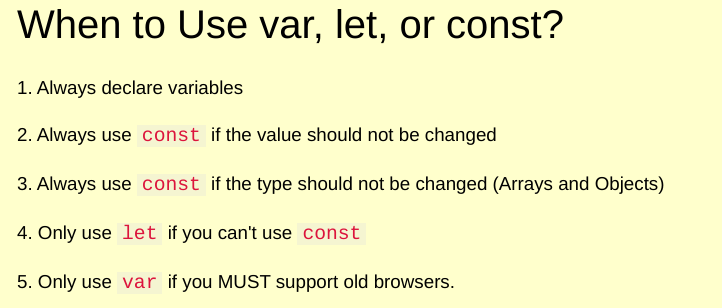

   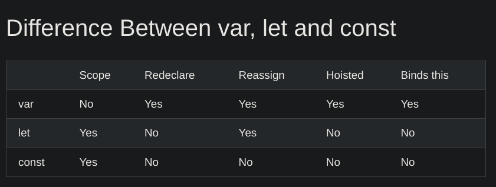

### All data types are inherited like python, no declaration required
### for + while + do while loops like c / c++
### Semicolons everywhere
### 

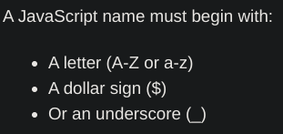

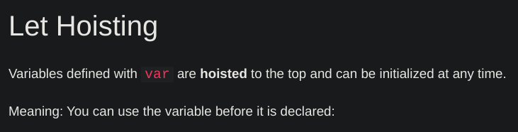

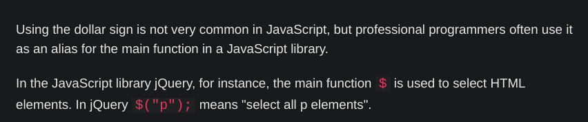

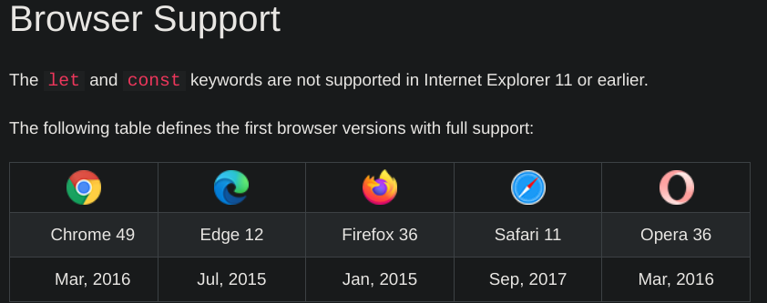

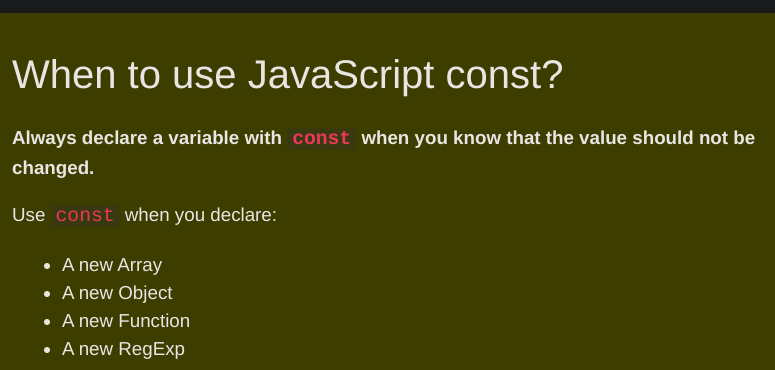

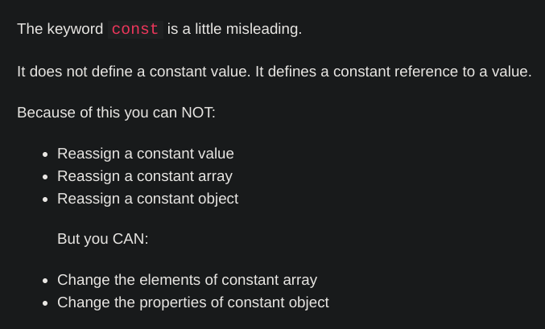

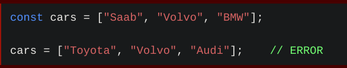

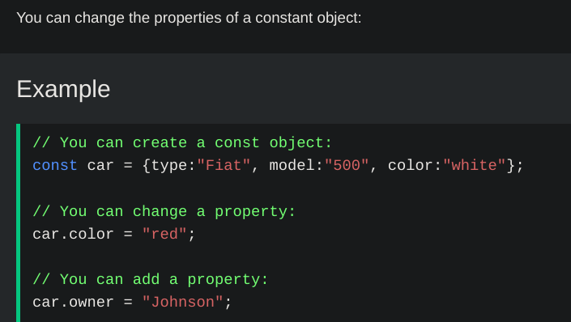

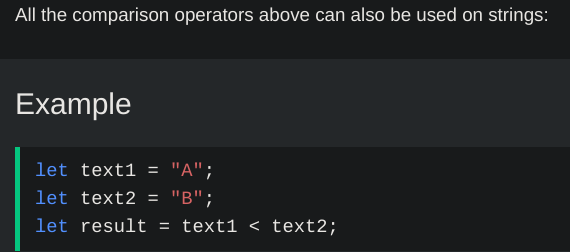

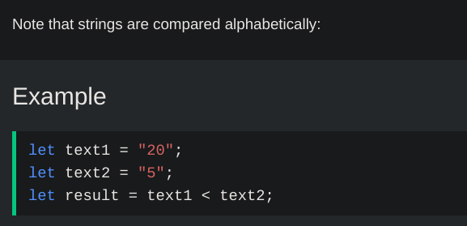

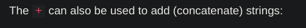

  

### + has left to right precendene in the evaluation tree
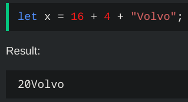
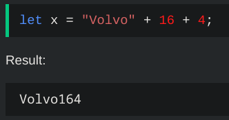

--- 

# Arithematic
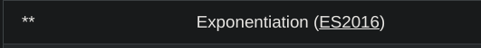

# Data types

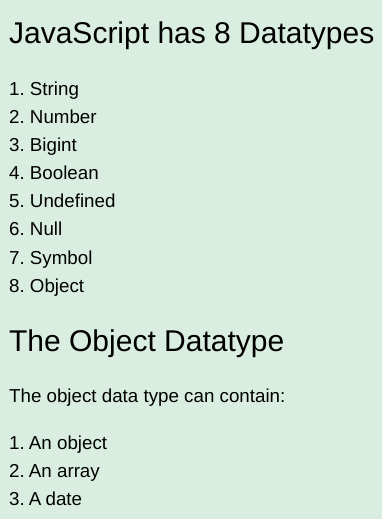

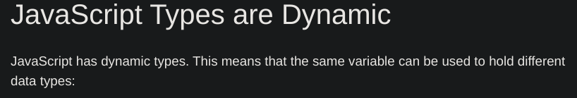

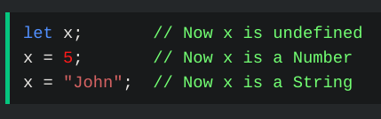

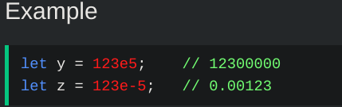

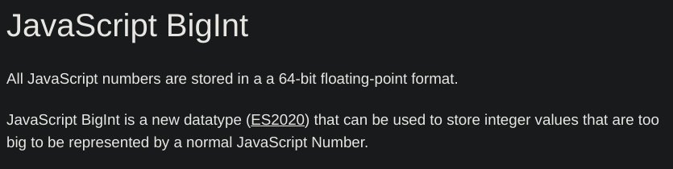

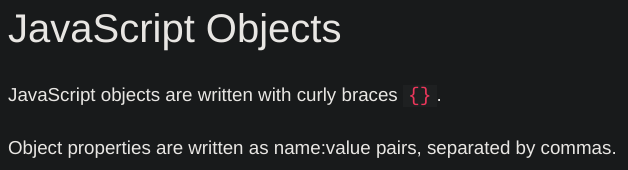

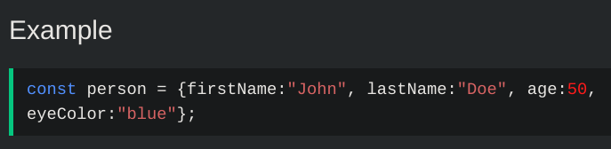

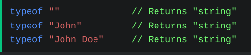

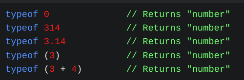

# Functions

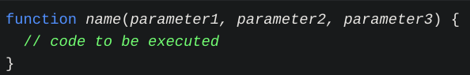

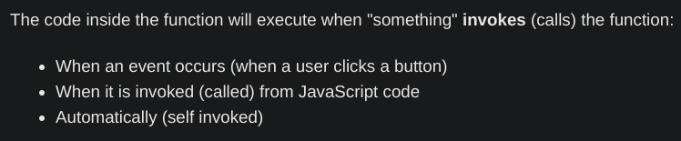

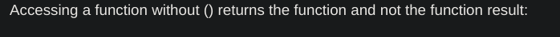

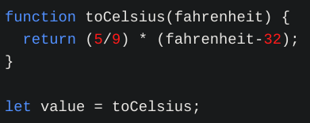

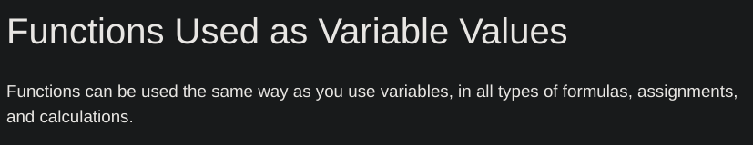

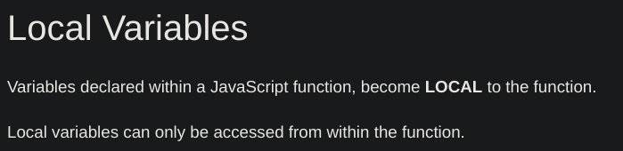

# Objects:

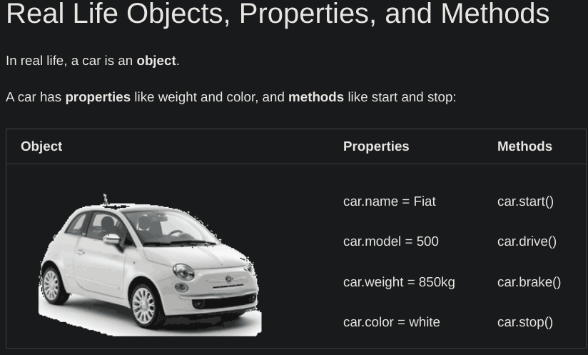

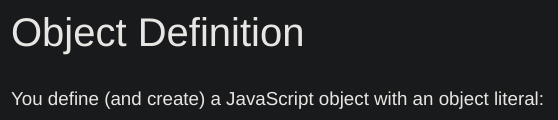

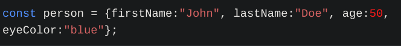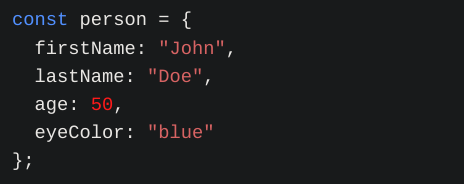

## Accessing the object properties:

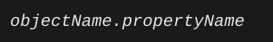
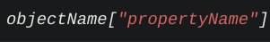
