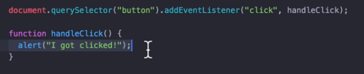
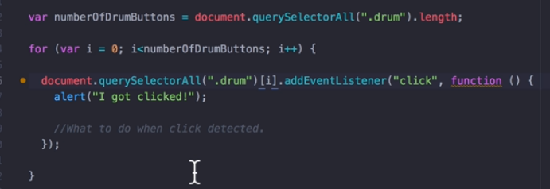
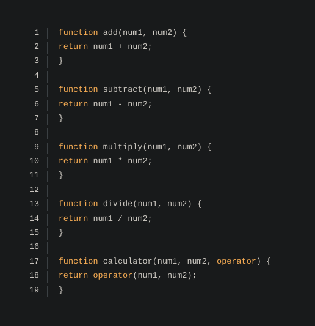
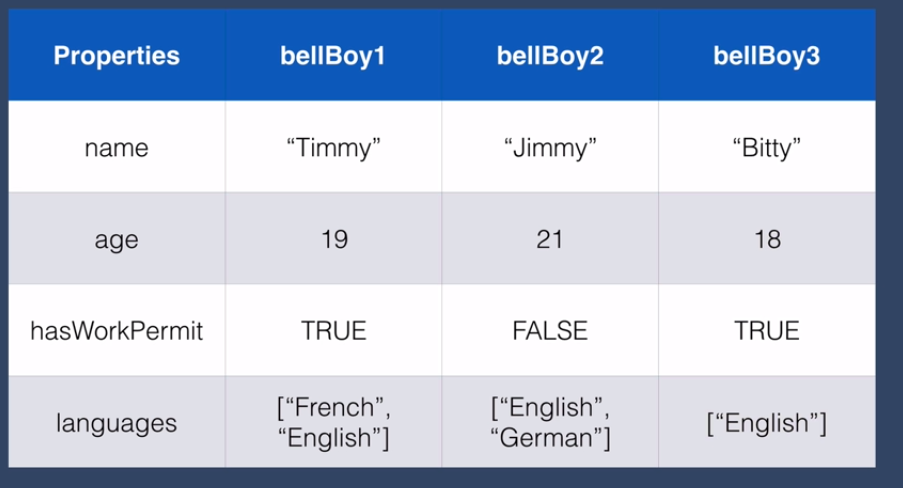
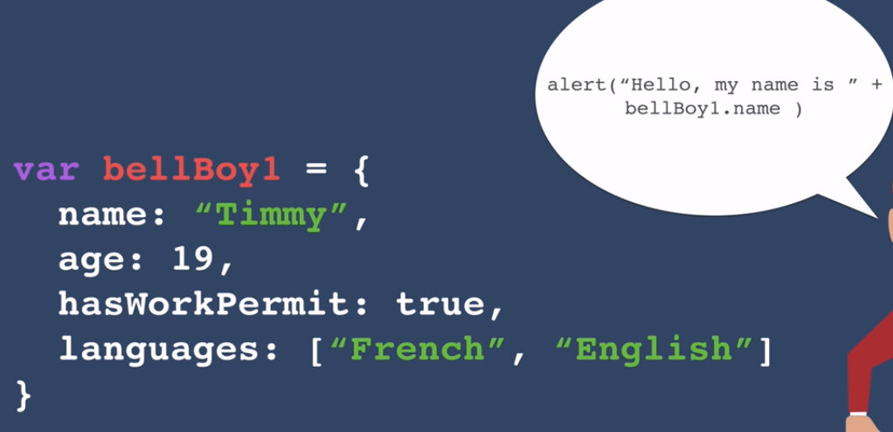
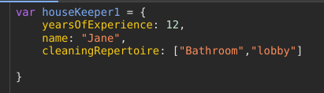
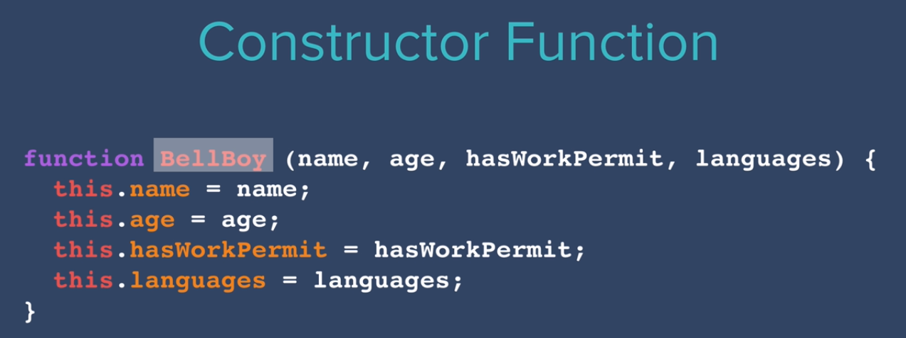

### Why are we not using parenthesis in the function ?

### That makes function trigger even without clicking th button.

using annonymous functions:  

## JS Objects:

- No camel casing, first charecter is always capitalise to differentiate from other functions.
