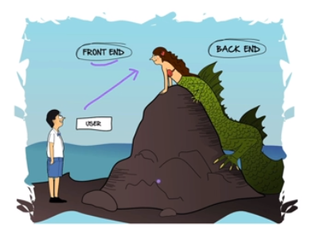
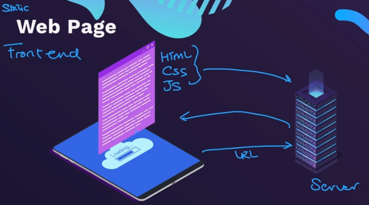
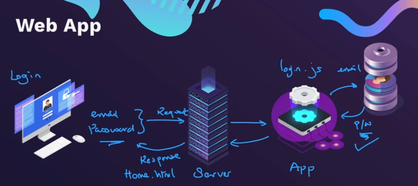
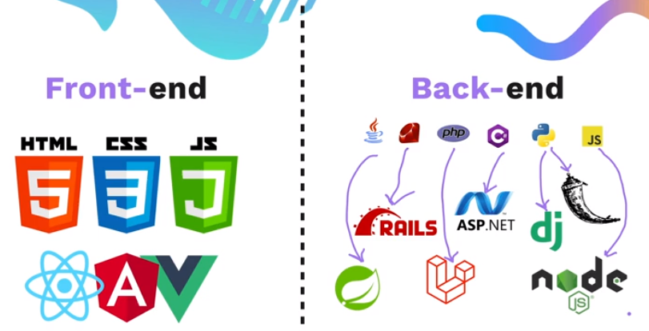
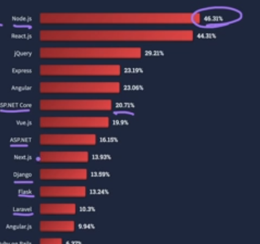

# Backened Dev

## 191. Backend Web Development Explained

## Has 3 compponents:
### 1. Server
### 2. Application
### 3. Backened
---
## 1. Server
### A computer that listens to incoming requests
### supposed to bw ON 24/7

## 2. Appilication
### - The logic
### - Responds to requests and does the job
### - sends error if request in invalid

## 3. Database
### - Stores your data 

## Webpage vs webpage:

  
### - Has no app or database  

## 192. Backend Tools and Technologies - Which one to learn?

### - Front end can only be in HTML, CSS and JS
### - Backened can be written in many different prog languages

### - NodeJS is the number 1 most popular frameworks:

